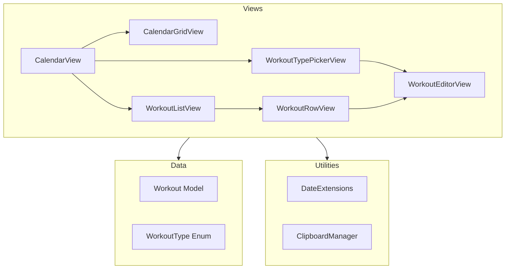
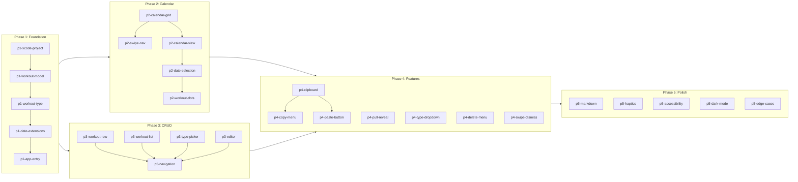

# Workout Logger iOS App Implementation

## Summary

Build a minimal iOS workout logger using SwiftUI + SwiftData. Calendar-based UI showing workout dots, free-form markdown notes, copy/paste between dates. CloudKit deferred.

## Tech Stack

- Swift 6.2+, iOS 26.1+
- SwiftUI for UI
- SwiftData for local persistence (CloudKit-ready for later)
- Native `AttributedString` for markdown rendering

## Architecture



## File Structure

```
WorkoutLogger/
├── WorkoutLoggerApp.swift
├── Models/
│   └── Workout.swift
├── Views/
│   ├── CalendarView.swift
│   ├── WorkoutListView.swift
│   ├── WorkoutTypePickerView.swift
│   ├── WorkoutEditorView.swift
│   └── Components/
│       ├── CalendarGridView.swift
│       └── WorkoutRowView.swift
├── Utilities/
│   ├── WorkoutType.swift
│   ├── DateExtensions.swift
│   └── ClipboardManager.swift
└── Resources/
    └── Assets.xcassets
```

## Execution Order & Parallelization



### Parallelization Summary

| Phase   | Execution       | Notes                                                                          |
| ------- | --------------- | ------------------------------------------------------------------------------ |
| Phase 1 | Sequential      | Must complete first; creates project foundation                                |
| Phase 2 | After Phase 1   | Can run in parallel with Phase 3                                               |
| Phase 3 | After Phase 1   | Can run in parallel with Phase 2; p3-a/b/c/d are parallel, p3-e depends on all |
| Phase 4 | After Phase 2+3 | p4-a blocks p4-b/c; p4-d/e/f/g are independent                                 |
| Phase 5 | After Phase 4   | All tasks can run in parallel                                                  |

---

## Implementation Phases (Detailed)

### Phase 1: Foundation (Sequential)

| Task ID            | Description                                | Depends On         |
| ------------------ | ------------------------------------------ | ------------------ |
| p1-xcode-project   | Create Xcode project with folder structure | -                  |
| p1-workout-model   | Create Workout.swift SwiftData model       | p1-xcode-project   |
| p1-workout-type    | Create WorkoutType.swift enum              | p1-workout-model   |
| p1-date-extensions | Create DateExtensions.swift                | p1-workout-type    |
| p1-app-entry       | Set up WorkoutLoggerApp.swift              | p1-date-extensions |

### Phase 2: Calendar UI

| Task ID           | Description                       | Depends On        |
| ----------------- | --------------------------------- | ----------------- |
| p2-calendar-grid  | Build CalendarGridView month grid | Phase 1           |
| p2-swipe-nav      | Add swipe gesture navigation      | p2-calendar-grid  |
| p2-calendar-view  | Build CalendarView main screen    | p2-calendar-grid  |
| p2-date-selection | Implement selectedDate state      | p2-calendar-view  |
| p2-workout-dots   | Add colored dots under dates      | p2-date-selection |

### Phase 3: Workout List & CRUD

| Task ID         | Description                           | Depends On                                                 |
| --------------- | ------------------------------------- | ---------------------------------------------------------- |
| p3-workout-row  | Build WorkoutRowView component        | Phase 1                                                    |
| p3-workout-list | Build WorkoutListView + empty state   | Phase 1                                                    |
| p3-type-picker  | Build WorkoutTypePickerView modal     | Phase 1                                                    |
| p3-editor       | Build WorkoutEditorView with autosave | Phase 1                                                    |
| p3-navigation   | Wire up all navigation flows          | p3-workout-row, p3-workout-list, p3-type-picker, p3-editor |

### Phase 4: Advanced Features

| Task ID          | Description                 | Depends On   |
| ---------------- | --------------------------- | ------------ |
| p4-clipboard     | Create ClipboardManager     | Phase 3      |
| p4-copy-menu     | Add copy context menu       | p4-clipboard |
| p4-paste-button  | Add paste button to picker  | p4-clipboard |
| p4-pull-reveal   | Pull-to-reveal date header  | Phase 3      |
| p4-type-dropdown | Type dropdown in editor nav | Phase 3      |
| p4-delete-menu   | Delete action in ... menu   | Phase 3      |
| p4-swipe-dismiss | Swipe-right-to-dismiss      | Phase 3      |

### Phase 5: Polish (All Parallel)

| Task ID          | Description          | Depends On |
| ---------------- | -------------------- | ---------- |
| p5-markdown      | Markdown rendering   | Phase 4    |
| p5-haptics       | Haptic feedback      | Phase 4    |
| p5-accessibility | Accessibility labels | Phase 4    |
| p5-dark-mode     | Dark mode testing    | Phase 4    |
| p5-edge-cases    | Edge case testing    | Phase 4    |

---

## Key Implementation Details

**SwiftData Model** (`Workout.swift`):

- `date` normalized to start of day for grouping
- `createdAt`/`editedAt` preserve actual timestamps

**Calendar Dots Query**:

- Query workouts for visible month range only
- Group by date, show max 3 dots per date

**Autosave**:

- `onChange(of: notes)` triggers save
- Optional 300ms debounce for performance

**Copy/Paste Format**:

- Clipboard string: `"Upper||||Notes content here"`
- Parse on picker appear, show paste button if valid

---

## Notes

- CloudKit can be enabled later by adding `.modelContainer(for: Workout.self, isCloudKitEnabled: true)` and enabling iCloud capability
- No third-party dependencies needed for v1
- When delegating to agents, provide the spec file and relevant task context
